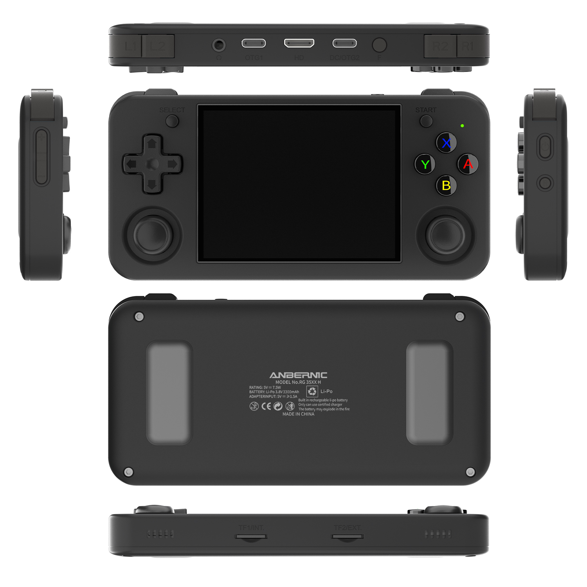

# Anbernic RG35XXH
This is my handheld classic game. 

Details:
  - Product Information - 
[AnbernicRG35XXH](
https://win.anbernic.com/product/364.html)
  - List of OS:
    1. [KNULLI](https://knulli.org/) (Currently running) base on batocera [New install](https://knulli.org/play/install/),  [Old Install Page](https://rg35xx-cfw.github.io/1_Installation)
    2. [MuOS](https://www.rg35xx.com/en/firmwares-2/muos/). I see alot people using this custom os. The next one going to try out.
    3. Anbernic RG35XXH offical OS [download Page](https://win.anbernic.com/download/360.html)

## Spec:
| Type | Value|
| --- | --- |
|Color|Black |
| Screen	| 3.5-inch IPS full viewing angle, OCA full lamination/ 640*480|
|CPU|	H700 quad-core ARM Cortex-A53, 1.5GHz frequency|
|GPU|dual- core G31 MP2|
|RAM |	LPDDR4  1GB|
|Storage |	Extral MicroSD 64GB TF|
|System  |	Linux|
|WIFI/Bluetooth  |	2.4/5G WIFI 802.11a/b/g/n/ac,Bluetooth 4.2
|Games	Support | ported games,PSP,PS1,DC,NDS,ARCADE,GBA,GBC,GB,SFC,FC,MAME,MD,MD-CD,GG,PCE,PCE-CD,NGPC,SMS,WSC and other games in various formats.|
|Speaker |	High-fidelity speaker|
|TF card |	Dual card slots, support TF card expansion, maximum 512GB|
|Battery |	Li-polymer battery 3300mAh, lasting 8 hours|
|Charging |	5V/1.5A, support C2C charger|
|Other function |	Support 2.4G wireless and wired controller, Bluetooth Handle Connection，HDMI output TV, vibration motor. WIFI online pairing, streaming|
|Accessories |	USB charging cable, giftbox , user manual, screen protector|
|Carton  Specification |	length 38.5cm	width 38.5cm	height17cm	weight 12.2KG（40pcs）|
|Box | specification	length 18.7cm	width 9.3cm	height 3cm	weight  0.290kg|
|Console | specification	length 14.5cm	width6.9cm	height 1.6cm	weight  0.180 kg|

