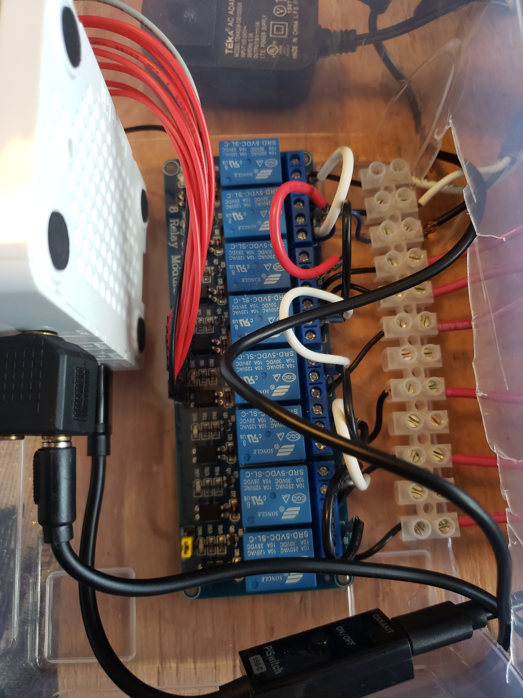

# Holidays Light System

I wanted to create automated Christmas light system that include little hard and software. Currently use both Christmas and Halloween.

This project is to document what I did and to step to recreate what I have done. 

## Videos:
2022 Christmas Light Show:

2022 Halloween Light Show:

My System 3rd version:

## Items:
- Pi 4b
- 8 port relay
- Wire
- Audio split 
- FM (car Radio)

## Wiring:

### This diagram of the wiring:

Real Pictures:

### Outlet Box:

Outlet box was easyer part has not much changes over time. I number then so in software I can have on outlet on all times. Allows for lazer lights on. They do not work with power being on / off fast. 

8 Channel Relay:
One hardest part. I found out that wires were pulling out trying to get all the wires together in small area

## Software: 

- Lightshow PI at https://bitbucket.org/togiles/lightshowpi/src/master/
  Interface: 
- Raspberry OS 32:

### Setup:
The following is how I setup my systme:

#### Raspberry OS:

#### Lightshow PI Setup:
- created self setup.sh in file with my own config. 
- Get layout of pins for device by using `gpio readall` I like to do that form ssh

